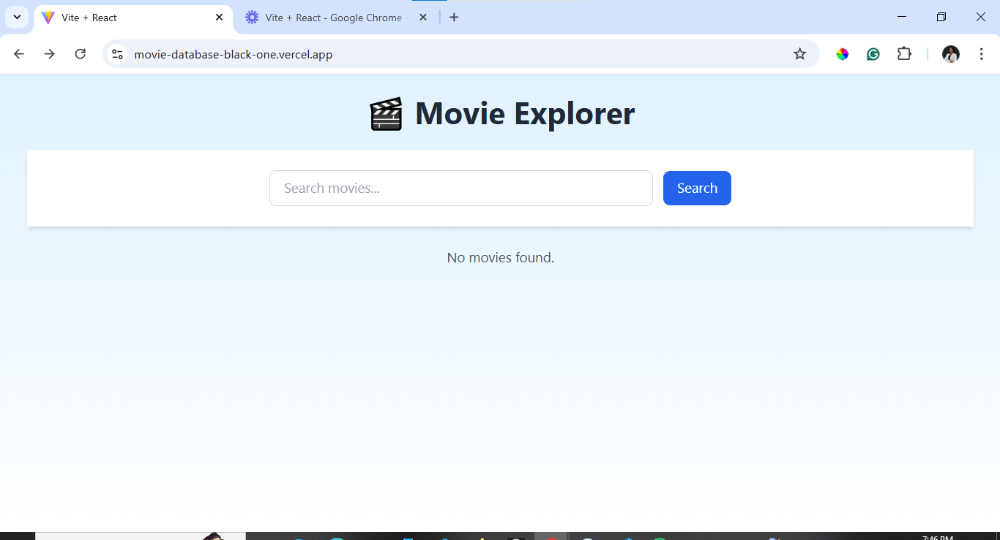

Movie Database Web Application
This is the capstone project for the ALX Frontend Engineering course. It is a simple movie database web application built using React, Vite, and Tailwind CSS. The goal of the project is to demonstrate an understanding of modern frontend tools and practices, as well as responsive design.

Technologies Used
React

Vite

Tailwind CSS

JavaScript (JSX)

Git and GitHub

Getting Started
Follow the steps below to run the project locally:

Clone the repository:

git clone https://github.com/fatimaochalifu/capstoneproject_moviedatabase.git
cd capstoneproject_moviedatabase
Install the project dependencies:
npm install
Start the development server:
npm run dev
Open your browser and go to:
http://localhost:5173
Features
Browse a collection of movies

View movie details

Responsive design using Tailwind CSS

Screenshots

Live Demo
https://www.loom.com/share/834df011c0544adf93abb2634f3c335f?sid=18dbb95a-61ab-4a12-9333-cb1843deaa29

Author
Fatima Binta Ochalifu
Frontend Developer | ALX Capstone Project